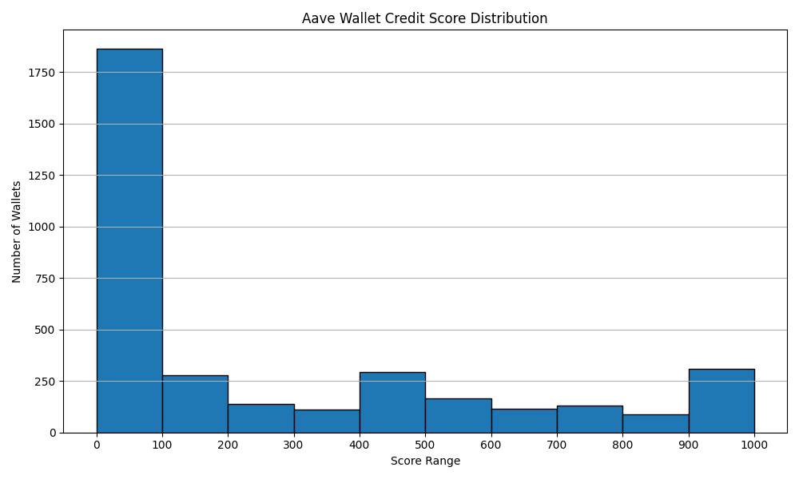

# Credit Score Analysis for Aave V2 Wallets

This analysis explains how wallet credit scores were calculated using Aave V2 data and what the results reveal about user behavior. The system uses a rule-based scoring approach to rank each wallet based on how safely and responsibly it interacts with Aave.

---

## What Was the Goal?

The main goal of this project was to:
- Assign each Aave V2 wallet a score (0 to 1000) using on-chain interaction data
- Label each wallet as "Excellent", "Good", "Fair", "Poor", or "Very Poor"
- Understand user behavior based on their Aave usage

---

## How the Project Worked

1. **Data Processing:**
   - Loaded raw wallet activity on Aave V2
   - Created a new dataset containing useful features for each wallet

2. **Feature Extraction:**
   For each wallet, several features were calculated:
   - `total_transactions`: total number of Aave actions performed
   - `deposit_count`: total deposits made
   - `borrow_count`: total borrow transactions
   - `repay_count`: number of repayments made
   - `liquidation_count`: how many times the wallet was liquidated
   - `repay_ratio`: proportion of borrows that were repaid
   - `days_active`: number of days between first and last activity
   - `transactions_per_day`: activity level per day
   - `liquidation_rate`: ratio of liquidations to borrows (if any)
   - `unique_actions`: number of different types of actions performed

3. **Scoring & Labeling:**
   - A **rule-based scoring system** was used to assign a credit score (0 to 1000) to each wallet.
   - More trustworthy behavior (like repaying loans, being active longer, using more features) resulted in a higher score.
   - More risky behavior (no repayments, frequent liquidations) led to lower scores.

4. **Output:**
   - Generated a score and label for each wallet
   - Saved the results to a CSV file for use in visualization or evaluation

>  The complete code used for scoring is in the `zeru.ipynb` notebook.
>  The score distribution chart (`score_distribution.png`) is provided in the repo.

---

## Score Distribution

Most wallets scored low, while only a small number earned very high scores.

| Score Range | Label        | Insight                             |
|-------------|--------------|--------------------------------------|
| 800–1000    | Excellent     | Long-term, safe, and reliable users |
| 600–800     | Good          | Generally responsible               |
| 400–600     | Fair          | Mixed behavior                      |
| 200–400     | Poor          | Below-average behavior              |
| 0–200       | Very Poor     | High-risk or no repayment activity  |

---

## What Did I Learn From the Data?

- The rule-based scoring system separates good and bad users effectively.
- “Excellent” wallets used Aave for many days, performed different types of actions, avoided liquidation, and repaid loans.
- “Very Poor” wallets did not repay anything, got liquidated, or only used Aave for a short time.
- Features like `repay_ratio` and `liquidation_rate` clearly show the difference between safe and risky users.

---

## Additional Insights From the Data

These insights were gained by analyzing the full dataset (3497 wallets):

### 1. Most Users Interacted Very Little
- Median wallet made only **3 total transactions**
- 25% of users made just **1 transaction**
>  Most users tried Aave only once or twice.

### 2. Borrowing and Repayment Are Rare
- More than half the wallets **never borrowed or repaid at all**
>  Many users likely used Aave as a deposit platform only.

### 3. Liquidation Is Uncommon
- 75% of wallets had **zero liquidations**
>  Most users are not taking high-risk loans.

### 4. Most Wallets Were Short-Term Users
- Median `days_active` = **3 days**, 25% used Aave for just **1 day**
>  Quick-use or one-time interactions are common.

### 5. Only a Few Users Fully Engaged
- Median `unique_actions` = **2** out of a possible 5  
- Max = 5  
>  Most wallets only used a couple features; few explored the platform fully.

### 6. Most Scores Are Very Low
- **Average score** is just **~282**  
- A few “Excellent” users earned high scores — up to **1000**
>  High scores are rare. Most users behave too simply to earn them.

---

## Final Summary

This project successfully built a rule-based credit scoring system using only Aave V2 transaction behavior. The results clearly highlight wallet risk levels based on real usage patterns. Most wallets scored low due to limited activity, no repayments, or inactive behavior — while top scores went to only a few well-behaved, diverse, and long-term users.

➡ This approach makes scoring fully explainable and customizable — with no AI or black box, just real rules based on real behavior.

